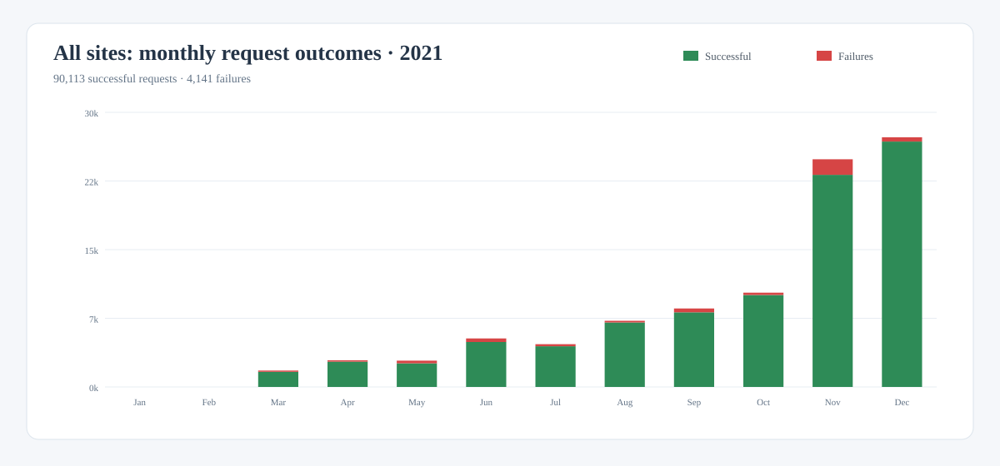
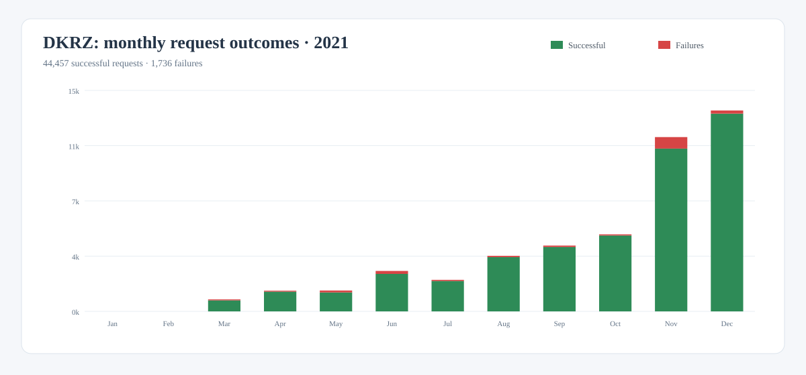
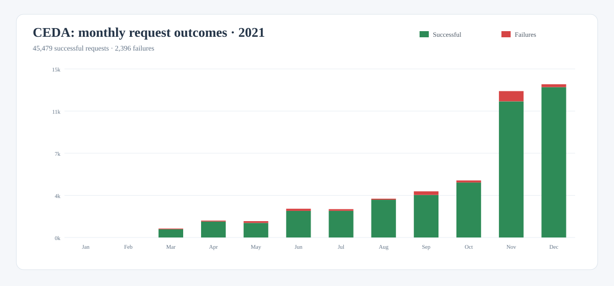
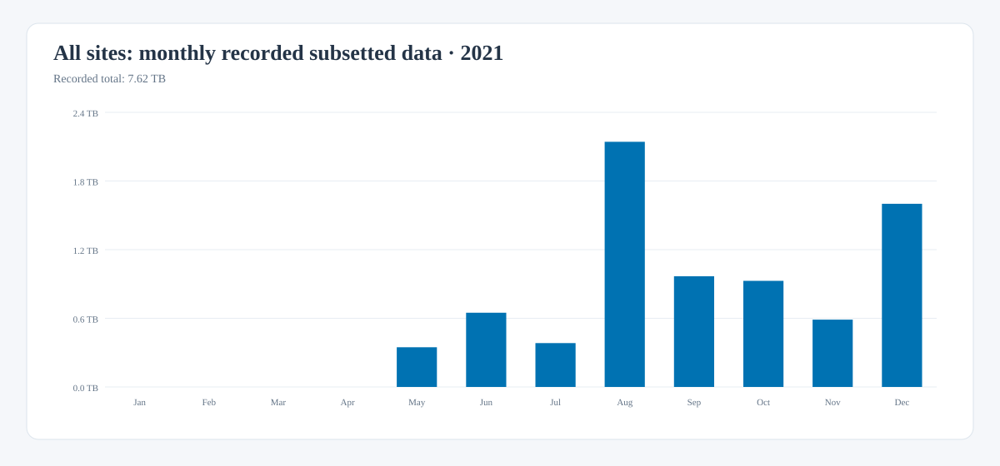
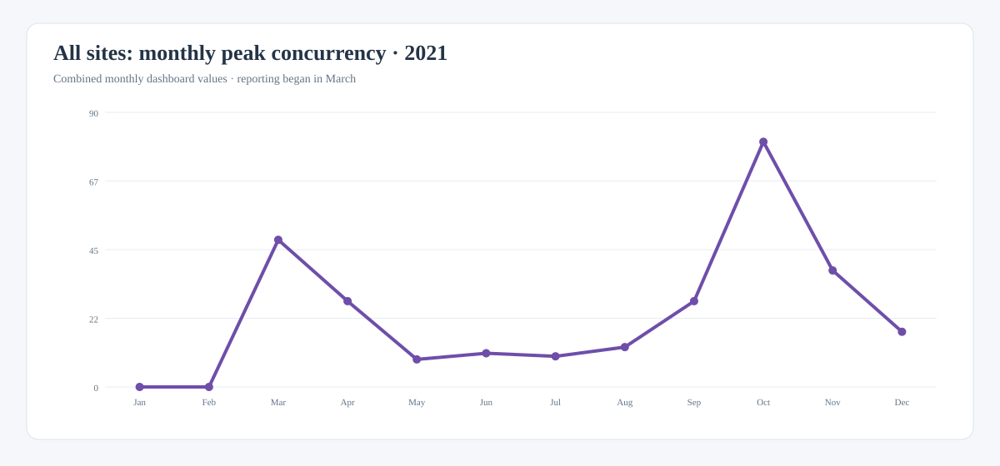

# ROOCS 2021 annual summary

Monthly ROOCS reporting began in March 2021. From March through December, the
available combined exports record **94,254 requests**, of which
**90,113 were successful**, and **7.62 TB**
of subsetted data across DKRZ and CEDA.

| Scope | Requests | Successful | Failures | Recorded subsetted data | Peak concurrency |
| --- | ---: | ---: | ---: | ---: | ---: |
| All sites, March–December | 94,254 | 90,113 | 4,141 (4.39%) | 7.62 TB | 80 |
| DKRZ | 46,193 | 44,457 | 1,736 (3.76%) | 5.44 TB | 37 |
| CEDA | 47,875 | 45,479 | 2,396 (5.00%) | 1.18 TB | 80 |

The DKRZ and CEDA request figures cover March–December. Their transfer columns
only contain the available site-level July–December values; March–June transfer
cannot be divided reliably between the sites.

## Monthly request outcomes

The green portion of each bar represents successful requests; failures are
shown in red. January and February are empty because monthly reporting had not
yet started.

### All sites

[Download this chart as SVG](../downloads/stats/roocs-2021-requests-all.svg){: download }

### DKRZ

[Download this chart as SVG](../downloads/stats/roocs-2021-requests-dkrz.svg){: download }

### CEDA

[Download this chart as SVG](../downloads/stats/roocs-2021-requests-ceda.svg){: download }

### Understanding the failures

Most failed requests were caused by users accessing the services directly
through the CDS API rather than through the CDS portal. In this workflow there
is no CDS catalogue interface to guide or validate the available parameters, so
users commonly rely on trial and error to discover valid request combinations.
These invalid requests are counted as failures even though the service itself
is operating normally.

A smaller share resulted from temporary infrastructure problems, such as full
temporary disks or unavailable Lustre storage. The statistics also include
genuine processing failures discovered during normal operation, including
issues related to calendar handling. The available dashboard data does not
provide a reliable numerical breakdown among these causes.

## Monthly subsetted data

The chart shows the transfer volume recorded in the combined monthly exports.

[Download this chart as SVG](../downloads/stats/roocs-2021-subsetted-data-all.svg){: download }

## Monthly peak concurrency

The chart uses the combined monthly export because the site split is not
available for the first part of the reporting period.

[Download this chart as SVG](../downloads/stats/roocs-2021-concurrency-all.svg){: download }

## Data and methodology

Combined monthly exports provide the overall request, failure, transfer, and
concurrency series. DKRZ and CEDA request outcomes for March–June were recovered
from the corresponding daily series in the full-year site exports; monthly site
exports are available from July onward.

The archived monthly files record 6.62 TB for July–December, while the existing
2021 dashboard page reports a rounded total of 11 TB for that period. This
summary retains the reproducible monthly values and therefore describes its
7.62 TB annual figure as recorded data rather than a complete transfer total.

The full-year overview reports 95,096 requests and 4,179 failures, compared
with 94,254 requests and 4,141 failures obtained by summing the monthly combined
exports. The site-level series also differ slightly from the combined series.
This summary consistently uses the monthly combined values for the overall
totals and charts, while showing the available site-series values separately.

[Download the monthly source data as CSV](../downloads/stats/roocs-2021-monthly.csv){: download }
