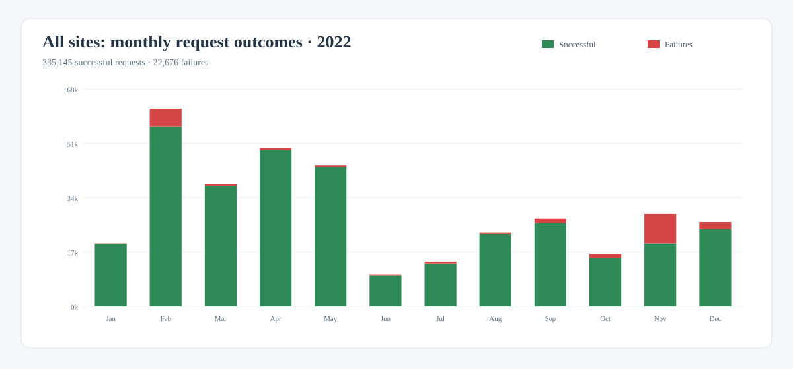
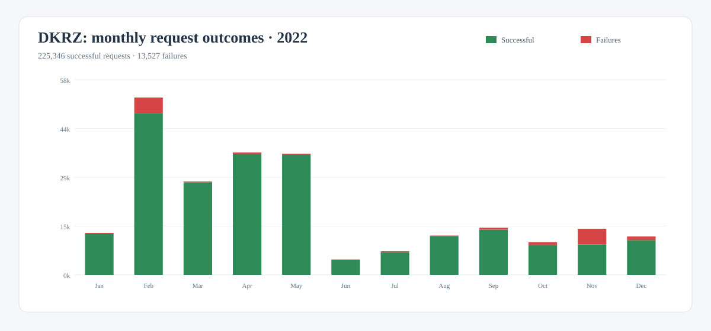
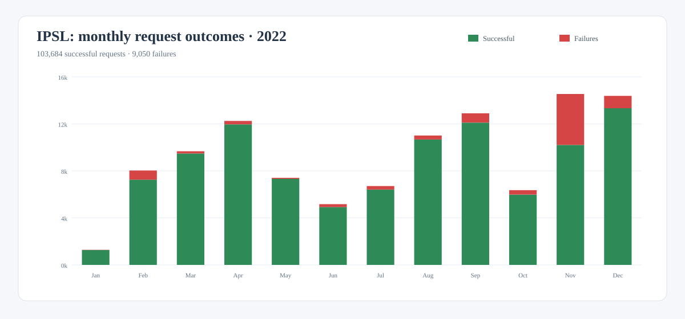
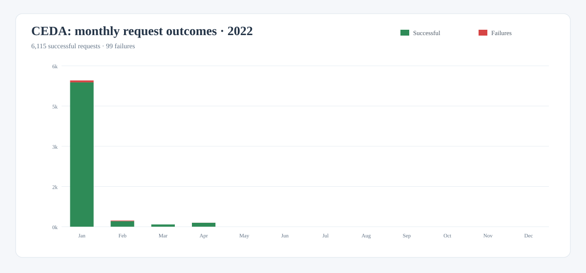
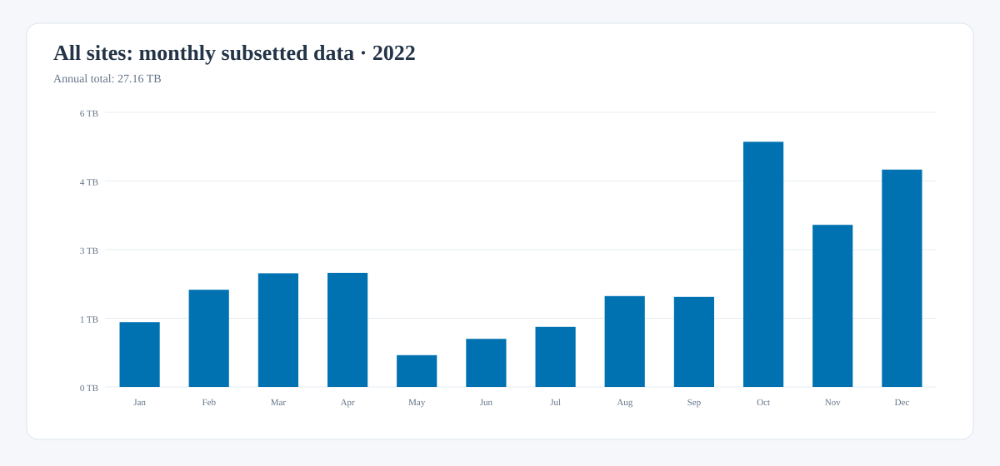
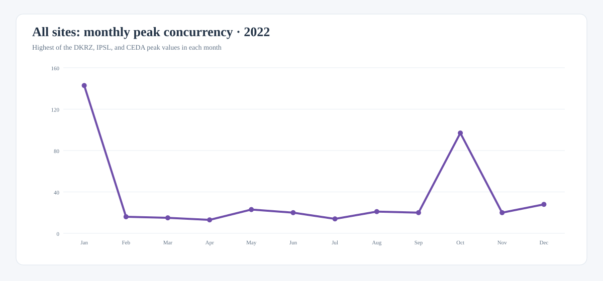

# ROOCS 2022 annual summary

This report summarizes monthly usage of the ROOCS subsetting services operated
by DKRZ, IPSL, and CEDA during 2022. Together, the services processed
**357,821 requests**, of which **335,145 were successful**,
and delivered **27.16 TB** of subsetted data.

| Scope | Requests | Successful | Failures | Subsetted data | Peak concurrency |
| --- | ---: | ---: | ---: | ---: | ---: |
| All sites | 357,821 | 335,145 | 22,676 (6.34%) | 27.16 TB | 143 |
| DKRZ | 238,873 | 225,346 | 13,527 (5.66%) | 16.24 TB | 28 |
| IPSL | 112,734 | 103,684 | 9,050 (8.03%) | 10.50 TB | 97 |
| CEDA | 6,214 | 6,115 | 99 (1.59%) | 0.42 TB | 143 |

## Monthly request outcomes

The green portion of each bar represents successful requests; failures are
shown in red.

### All sites

[Download this chart as SVG](../downloads/stats/roocs-2022-requests-all.svg){: download }

### DKRZ

[Download this chart as SVG](../downloads/stats/roocs-2022-requests-dkrz.svg){: download }

### IPSL

[Download this chart as SVG](../downloads/stats/roocs-2022-requests-ipsl.svg){: download }

### CEDA

[Download this chart as SVG](../downloads/stats/roocs-2022-requests-ceda.svg){: download }

### Understanding the failures

Most failed requests were caused by users accessing the services directly
through the CDS API rather than through the CDS portal. In this workflow there
is no CDS catalogue interface to guide or validate the available parameters, so
users commonly rely on trial and error to discover valid request combinations.
These invalid requests are counted as failures even though the service itself
is operating normally.

A smaller share resulted from temporary infrastructure problems, such as full
temporary disks or unavailable Lustre storage. The statistics also include
genuine processing failures discovered during normal operation, including
issues related to calendar handling. The available dashboard data does not
provide a reliable numerical breakdown among these causes.

## Monthly subsetted data

The monthly values combine the data delivered by DKRZ, IPSL, and CEDA.

[Download this chart as SVG](../downloads/stats/roocs-2022-subsetted-data-all.svg){: download }

## Monthly peak concurrency

For each month, overall concurrency is the highest peak reported by
DKRZ, IPSL, and CEDA. The site peaks are not added because they may have
occurred at different times.

[Download this chart as SVG](../downloads/stats/roocs-2022-concurrency-all.svg){: download }

## Data and methodology

Request, failure, and subsetted-data totals are sums of the monthly DKRZ,
IPSL, and CEDA dashboard exports. Successful requests are calculated as total
requests minus failed requests. Peak concurrency is not additive: the combined
monthly series uses the higher site value, and the annual value is its maximum.

Source note: CEDA contributed during the service transition through April. Its
January export omits transfer volume, so the value is inferred from the
published Q1 CEDA total of 420 GB. The April IPSL monthly export is missing;
request outcomes and concurrency were recovered from the Q2 daily series, and
its transfer value completes the published Q2 IPSL total of 1,366 GB. The
September IPSL export contains only 49.88 GB, so this summary uses the value
implied by the published Q3 IPSL total of 2,340 GB. The unusually high peaks of
143 for CEDA in January and 97 for IPSL in October come directly from the raw
monthly exports.

[Download the monthly source data as CSV](../downloads/stats/roocs-2022-monthly.csv){: download }
