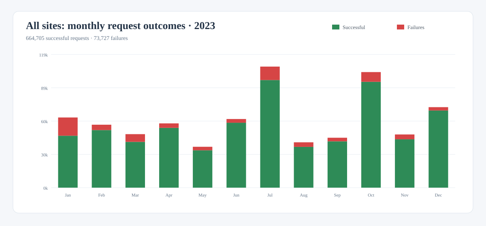
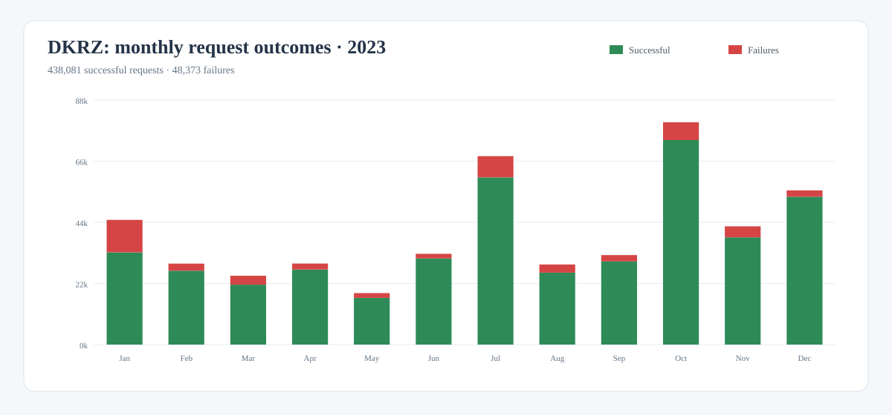
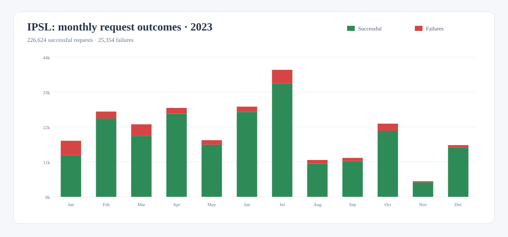
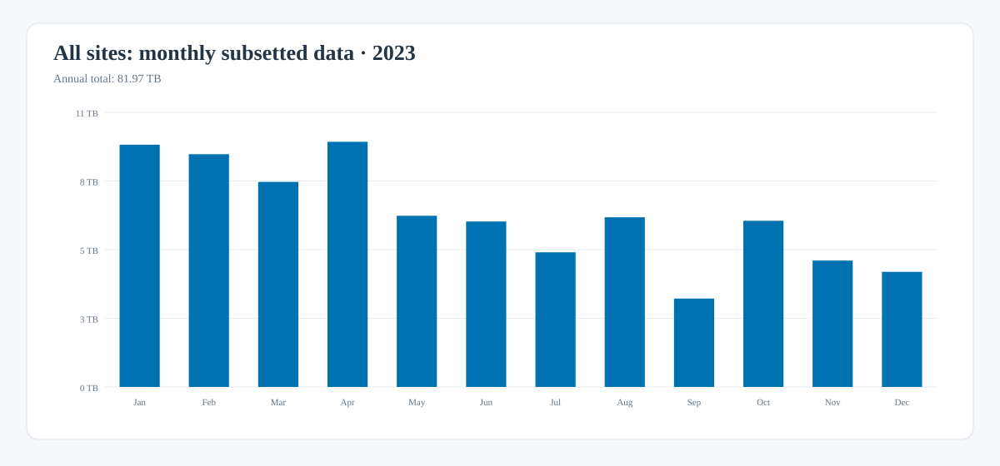
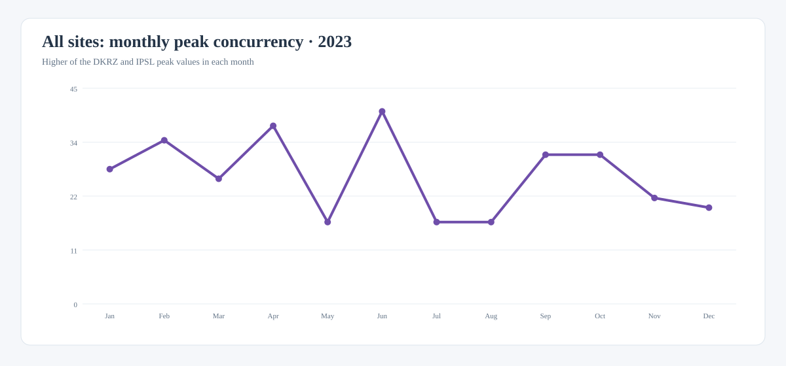

# ROOCS 2023 annual summary

This report summarizes monthly usage of the ROOCS subsetting services operated
by DKRZ and IPSL during 2023. Together, the services processed
**738,432 requests**, of which **664,705 were successful**,
and delivered **81.97 TB** of subsetted data.

| Scope | Requests | Successful | Failures | Subsetted data | Peak concurrency |
| --- | ---: | ---: | ---: | ---: | ---: |
| All sites | 738,432 | 664,705 | 73,727 (9.98%) | 81.97 TB | 40 |
| DKRZ | 486,454 | 438,081 | 48,373 (9.94%) | 52.10 TB | 31 |
| IPSL | 251,978 | 226,624 | 25,354 (10.06%) | 29.87 TB | 40 |

## Monthly request outcomes

The green portion of each bar represents successful requests; failures are
shown in red.

### All sites

[Download this chart as SVG](../downloads/stats/roocs-2023-requests-all.svg){: download }

### DKRZ

[Download this chart as SVG](../downloads/stats/roocs-2023-requests-dkrz.svg){: download }

### IPSL

[Download this chart as SVG](../downloads/stats/roocs-2023-requests-ipsl.svg){: download }

### Understanding the failures

Most failed requests were caused by users accessing the services directly
through the CDS API rather than through the CDS portal. In this workflow there
is no CDS catalogue interface to guide or validate the available parameters, so
users commonly rely on trial and error to discover valid request combinations.
These invalid requests are counted as failures even though the service itself
is operating normally.

A smaller share resulted from temporary infrastructure problems, such as full
temporary disks or unavailable Lustre storage. The statistics also include
genuine processing failures discovered during normal operation, including
issues related to calendar handling. The available dashboard data does not
provide a reliable numerical breakdown among these causes.

## Monthly subsetted data

The monthly values combine the data delivered by DKRZ and IPSL.

[Download this chart as SVG](../downloads/stats/roocs-2023-subsetted-data-all.svg){: download }

## Monthly peak concurrency

For each month, overall concurrency is the higher of the DKRZ and IPSL peak
values. The site peaks are not added because they may have occurred at different
times.

[Download this chart as SVG](../downloads/stats/roocs-2023-concurrency-all.svg){: download }

## Data and methodology

Request, failure, and subsetted-data totals are sums of the monthly DKRZ and
IPSL dashboard exports. Successful requests are calculated as total requests
minus failed requests. Peak concurrency is not additive: the combined monthly
series uses the higher site value, and the annual value is its maximum.

Source note: the January IPSL file spans both January and February, and the
October IPSL monthly export is missing. January and October request outcomes
and concurrency were therefore recovered from the daily series in the Q1 and
Q4 exports. The IPSL transfer exports are incomplete for those periods, so this
summary uses the monthly estimates recorded in the existing 2023 dashboard:
5,339 GB for January, 4,000 GB for February, 2,340 GB for March, and 500 GB for
October.

[Download the monthly source data as CSV](../downloads/stats/roocs-2023-monthly.csv){: download }
