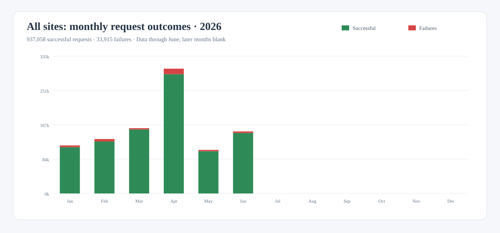
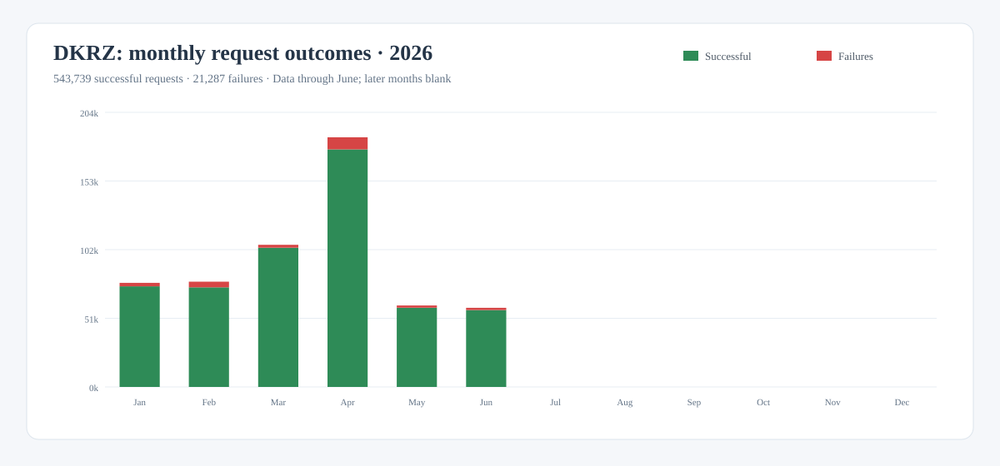
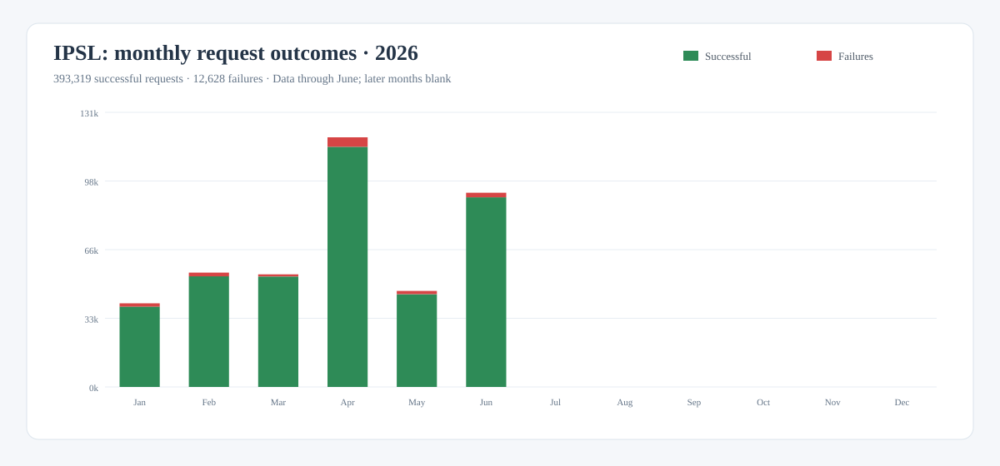
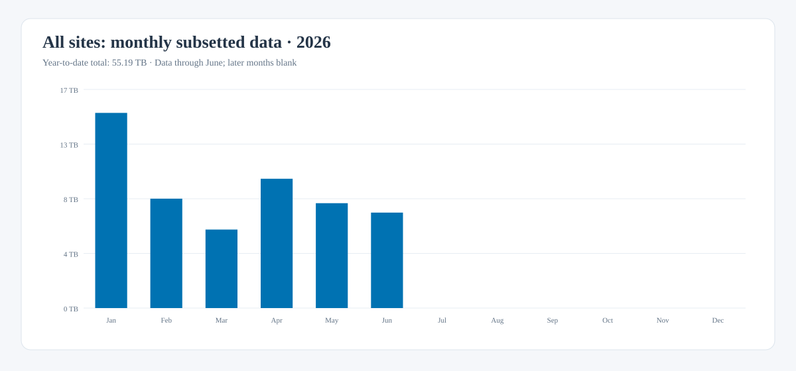
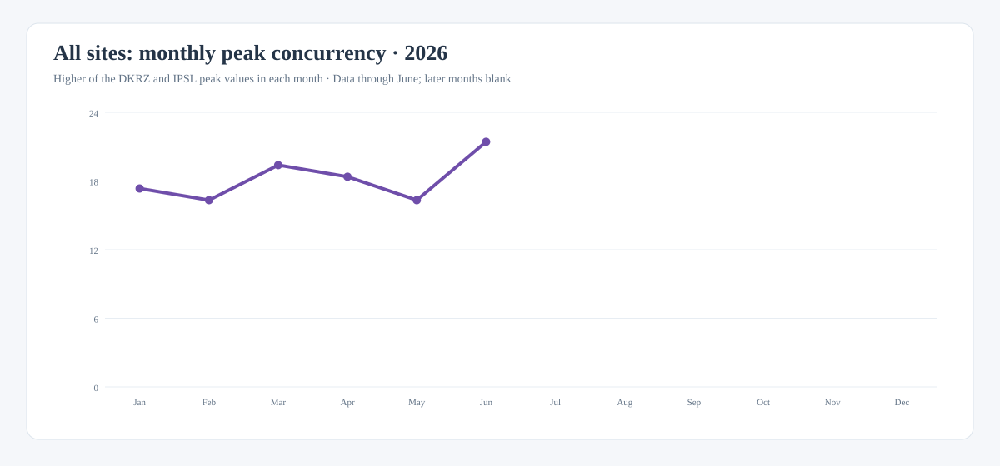

# ROOCS 2026 annual summary to date

This report summarizes monthly usage of the ROOCS subsetting services operated
by DKRZ and IPSL during January–June 2026. Together, the services processed
**970,973 requests**, of which **937,058 were successful**,
and delivered **55.19 TB** of subsetted data.

| Scope | Requests | Successful | Failures | Subsetted data | Peak concurrency |
| --- | ---: | ---: | ---: | ---: | ---: |
| All sites, January–June | 970,973 | 937,058 | 33,915 (3.49%) | 55.19 TB | 21 |
| DKRZ | 565,026 | 543,739 | 21,287 (3.77%) | 33.27 TB | 21 |
| IPSL | 405,947 | 393,319 | 12,628 (3.11%) | 21.93 TB | 18 |

## Monthly request outcomes

The green portion of each bar represents successful requests; failures are
shown in red.

### All sites

[Download this chart as SVG](../downloads/stats/roocs-2026-requests-all.svg){: download }

### DKRZ

[Download this chart as SVG](../downloads/stats/roocs-2026-requests-dkrz.svg){: download }

### IPSL

[Download this chart as SVG](../downloads/stats/roocs-2026-requests-ipsl.svg){: download }

### Understanding the failures

Of the 33,915 failed requests, 27,737 (81.8%) were classified as wrong
requests. These are mostly caused by users accessing the services directly
through the CDS API rather than through the CDS portal. Without the CDS
catalogue interface to guide and validate available parameters, users commonly
rely on trial and error to discover valid request combinations.

The remaining 6,178 failures (18.2%, or 0.64% of all requests) were classified
as internal errors. These include temporary infrastructure problems, such as
full temporary disks or unavailable Lustre storage, as well as genuine
processing defects discovered during operation, including calendar-handling
issues.

## Monthly subsetted data

The monthly values combine the data delivered by DKRZ and IPSL.

[Download this chart as SVG](../downloads/stats/roocs-2026-subsetted-data-all.svg){: download }

## Monthly peak concurrency

For each month, overall concurrency is the higher of the DKRZ and IPSL peak
values. The site peaks are not added because they may have occurred at different
times.

[Download this chart as SVG](../downloads/stats/roocs-2026-concurrency-all.svg){: download }

## Data and methodology

Request, failure, and subsetted-data totals are sums of the monthly DKRZ and
IPSL dashboard exports. Successful requests are calculated as total requests
minus failed requests. Peak concurrency is not additive: the combined monthly
series uses the higher site value, and the reporting-period value is its maximum.

Reporting note: 2026 is ongoing. This summary contains the complete monthly
exports currently available for January through June. Totals are derived
from those monthly DKRZ and IPSL exports and will increase as later months are
added. The existing H1 overview reports 970,976 requests and 53.90 TB, whereas
the sum of the monthly site exports is 970,973 requests and 55.19 TB. This page
uses the monthly values so its totals remain consistent with the charts and CSV.
The H1 overview's concurrency of 33 comes from the combined export; following
the method used on these annual pages, the chart instead uses the higher DKRZ or
IPSL peak in each month, producing a reporting-period peak of 21.

[Download the monthly source data as CSV](../downloads/stats/roocs-2026-monthly.csv){: download }
