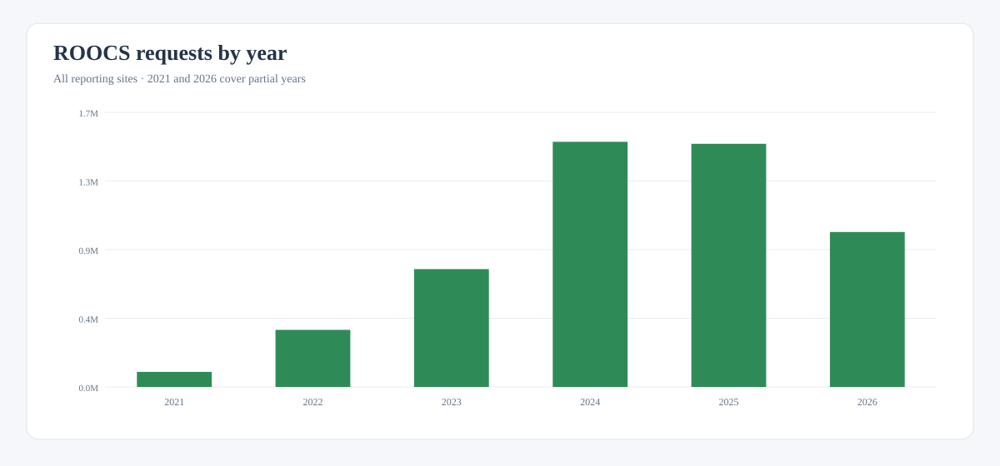
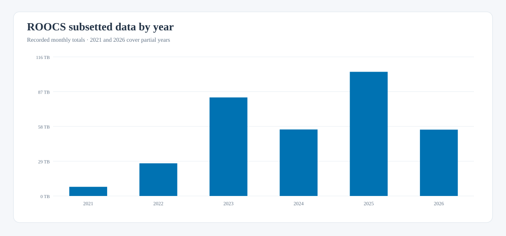

# ROOCS usage by year

This overview shows the total number of requests processed and the recorded
volume of subsetted data for each reporting year. Detailed request outcomes,
site breakdowns, and monthly charts are available from the linked annual pages.

| Year | Coverage | Requests | Subsetted data |
| --- | --- | ---: | ---: |
| [2021](summary-2021.md) | March–December (recorded) | 94,254 | 7.62 TB |
| [2022](summary-2022.md) | January–December | 357,821 | 27.16 TB |
| [2023](summary-2023.md) | January–December | 738,432 | 81.97 TB |
| [2024](summary-2024.md) | January–December | 1,536,287 | 55.32 TB |
| [2025](summary-2025.md) | January–December | 1,523,415 | 103.30 TB |
| [2026](summary-2026.md) | January–June (year to date) | 970,973 | 55.19 TB |

ROOCS is designed to subset large datasets before delivery. Transferred volume
is therefore not a metric to maximize: for equivalent scientific requests,
less data transferred generally means more effective subsetting and lower
network and storage costs.

## Requests

[Download this chart as SVG](../downloads/stats/roocs-all-years-requests.svg){: download }

## Subsetted data

[Download this chart as SVG](../downloads/stats/roocs-all-years-subsetted-data.svg){: download }

## Comparability

The 2021 series starts in March, and its transfer total reflects the values
recorded in the archived monthly exports; those exports are known to be
incomplete. The 2026 figure currently covers January through
June and will grow as later reports are added.
See the individual annual pages for source-specific notes.
